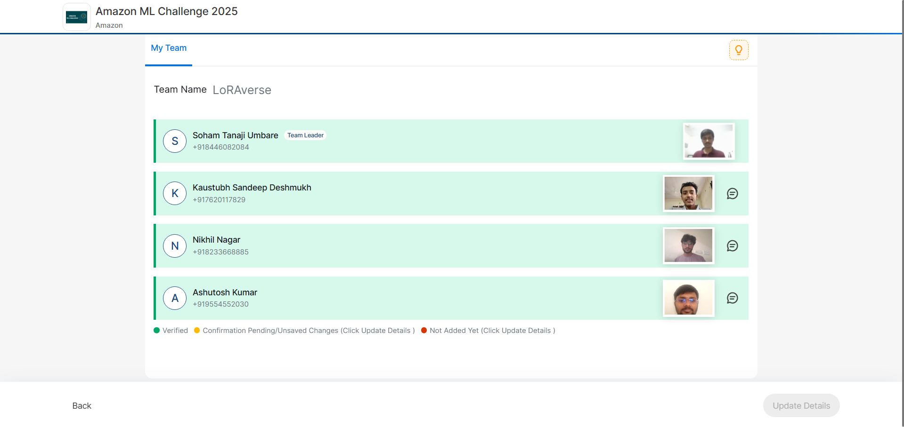
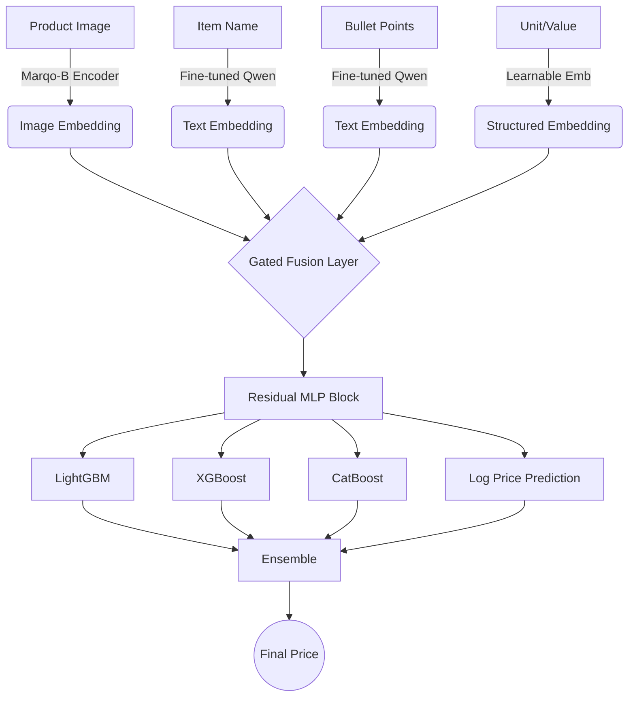

# Amazon ML Challenge 2025: Multimodal Product Pricing 


***Team LORAverse** Rank 377 / 82,787+ Participants (Top 0.5%)*
**Team Members**
- [Soham Tanaji Umbare](https://github.com/theSohamTUmbare)
- [Kaustubh Deshmukh](https://github.com/kaustubhdeshmukh11)
- [Ashutosh Kumar](https://github.com/AshutoshKumar1007)
- Nikhil Nagar



## 📖 Executive Summary
This repository contains the solution for the **Amazon ML Challenge 2025**, where our team engineered a multimodal deep learning pipeline to predict product prices based on images, textual descriptions, and structured catalog metadata.

Our approach combines a **fine-tuned Qwen-based text encoder**, a specialized **e-commerce image encoder (Marqo-B)**, and a **gated residual MLP** fusion mechanism. The final predictions are stabilized via a weighted ensemble with Gradient Boosted Decision Trees (LightGBM, XGBoost, CatBoost).

**Performance Metric:** 46.81 SMAPE (Symmetric Mean Absolute Percentage Error)

---

## 🏗️ System Architecture

Our solution uses a **Hybrid Multimodal Ensemble** strategy. We process text and images separately before fusing them into a shared latent space.



## 🏗️ Key Components

* **Text Encoder:** A **Qwen-4B variant** supervised fine-tuned on `(item_name, price)` pairs to capture price-sensitive semantics (e.g., differentiating "**Flagship Phone**" vs "**Budget Phone**").
* **Image Encoder:** **marqo-ecommerce-embeddings-B**, a 200M-parameter model specialized for e-commerce visual similarity, producing **512-dim embeddings**.
* **Structured Data:** Learnable embedding matrices (**32-dim**) for categorical units and numerical projection for scalar values.
* **Fusion Head:** A **Gated Residual MLP** that learns dynamic weights for each modality (e.g., prioritizing text for electronics, images for fashion).
    > 

---

## 🧠 Methodology

### 1. Data Analysis & Preprocessing

* **Outlier Removal:** Filtered extreme price outliers ($<1\%$ of data) to stabilize the regression head.
* **Feature Importance:** EDA revealed **item\_name** contained the strongest predictive signal, followed by structured metadata (value, unit).
* **Extraction:** Regex-based parsing was used to separate numerical values (e.g., "500") from units (e.g., "GB", "ml").

### 2. Training Strategy

* **Loss Function:** **MSE on $\log(\text{price})$** to handle the skewed price distribution.
* **Optimizer:** AdamW ($\text{lr}=1\text{e}-3$, $\text{weight\_decay}=1\text{e}-5$).
* **Batch Size:** 64.
* **Efficiency:** Image embeddings were **precomputed** to accelerate the training of the fusion head.

### 3. Ensemble Logic

The final prediction is a weighted average of the Deep Regressor and Gradient Boosters, favoring the Deep Model for representation learning while using Boosters for tabular pattern matching.

```python
final_pred_log = (
    0.85 * mlp_pred_log + 
    0.05 * lgb_pred_log + 
    0.05 * xgb_pred_log + 
    0.05 * cat_pred_log
)
final_price = expm1(final_pred_log)
```

## 📂 Repository Structure

* `final_submission.ipynb` – Contains the full pipeline: Qwen Fine-Tuning, Embedding Extraction, Gated MLP Definition, and Ensemble logic.

> 🚧 **Note:** Currently, the full training, preprocessing, and inference logic is consolidated in the Jupyter Notebooks provided above. We are in the process of refactoring this into a modular Python package structure for easier reproducibility.

---

## 🛠️ Tech Stack

| Category | Tools / Models |
| :--- | :--- |
| **Deep Learning** | PyTorch, Hugging Face Transformers |
| **Encoders** | Qwen-4B (Text), Marqo-Ecommerce-B (Vision) |
| **Boosting** | LightGBM, XGBoost, CatBoost |
| **Hardware** | Trained on NVIDIA GPUs (Colab Pro / Local Cluster) |

---

## 🏆 Acknowledgments

> This project was developed for the **Amazon ML Challenge 2025**

* **Team:** [Soham T. Umbare](https://github.com/theSohamTUmbare), [Kaustubh Deshmukh](https://github.com/kaustubhdeshmukh11), Nikhil Nagar, [Ashutosh Kumar](https://github.com/AshutoshKumar1007).
